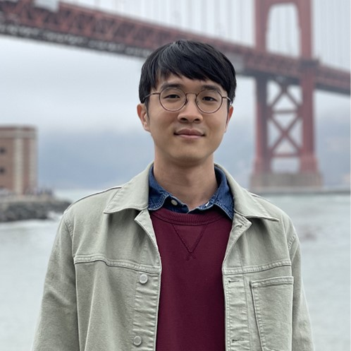
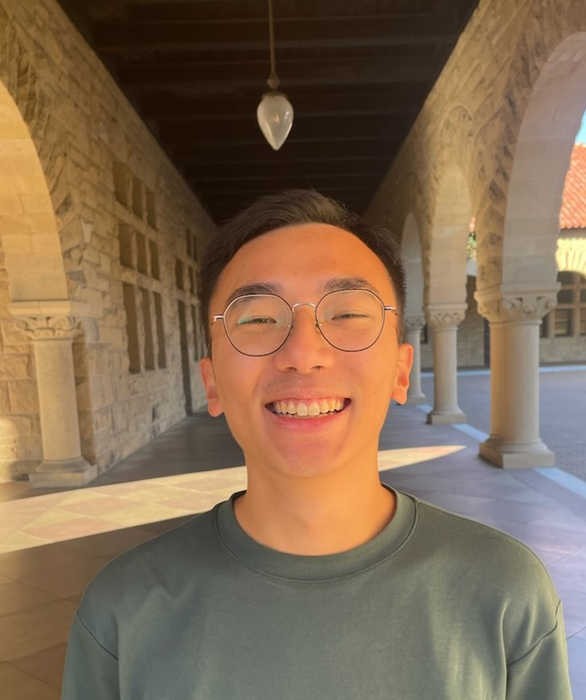
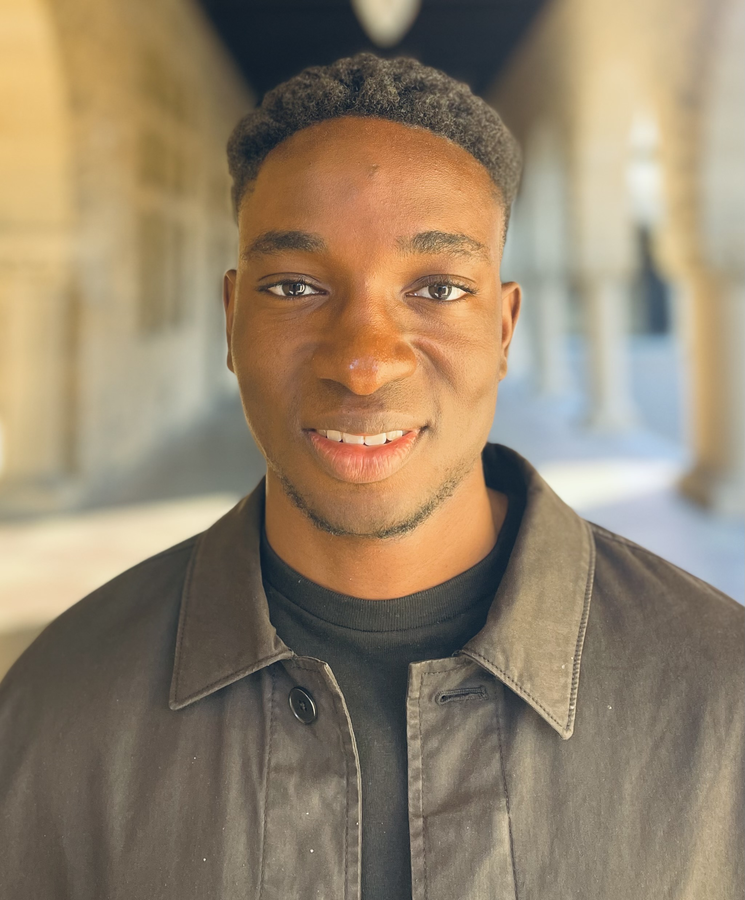

# Research Summary
Stanford accelerate group works on creating high performance and energy-efficient architectures and design methodology for domain-specific hardware accelerators in existing and emerging technologies.

# People
<table style="width:100%">
  <tbody>
    <tr>
      <td style="width:18%"></td>
      <td>
        <b>Priyanka Raina</b>  
        <b>Email:</b> praina AT stanford DOT edu 
        <b>Contact:</b> Allen Building - Room 114 
        <b>About:</b> Priyanka Raina is an Assistant Professor of Electrical Engineering at Stanford University. She received her BTech in Electrical Engineering from the IIT Delhi in 2011 and her SM and PhD in Electrical Engineering and Computer Science from MIT in 2013 and 2018. Priyanka’s research is on creating high-performance and energy-efficient architectures for domain-specific hardware accelerators in existing and emerging technologies and agile hardware-software co-design. Her research has won best paper awards at VLSI, ESSCIRC and MICRO conferences and in the JSSC journal. Priyanka teaches several VLSI design classes at Stanford. She has also won the Intel Rising Star Faculty Award, Hellman Faculty Scholar Award and is a Terman Faculty Fellow. </td>
    </tr>
  </tbody>
</table>

## PhD Students
<table style="width:100%">
  <tbody>
    <tr>
      <td style="width:18%"></td>
      <td>
        <b>Kathleen Feng</b>  
        <b>Email:</b> kzf AT stanford DOT edu, <a href="https://http://stanford.edu/~kzf/">Webpage</a> 
        <b>About:</b> Kathleen Feng is an EE Ph.D. student at Stanford University, supervised by Prof. Priyanka Raina. She received a B.S.E. degree in Electrical Engineering from Princeton University in 2018, with certificates in Applications of Computing and Robotics and Intelligent Systems. She is a recipient of the NDSEG Fellowship. 
        <b>Research:</b> Her research focuses on domain-specific hardware architectures and hardware-software co-design. She has worked on coarse-grained reconfigurable arrays for application acceleration and systems for running extended reality applications. Kathleen is interested in designing and developing new computer architectures for emerging applications.
      </td>
    </tr>
    <tr>
      <td style="width:18%"></td>
      <td>
        <b>Kalhan Koul</b>  
        <b>Email:</b> kkoul AT stanford DOT edu, <a href="https://www.linkedin.com/in/kalhan-koul-290b2487">Webpage</a> 
        <b>About:</b> Kalhan Koul is an EE Ph.D. student at Stanford University supervised by Prof. Priyanka Raina. Previously, he was a Digital Design Intern at Micron and Silicon Labs. He received a B.S. in Electrical Engineering Honors and a B.A. in Plan II Honors (Liberal Arts) from The University of Texas in 2018. 
        <b>Research:</b> My current research focuses on automatically mapping applications, ranging from machine learning to image processing, onto reconfigurable logic devices (CGRAs). Previously, I helped design and tape-out a DNN accelerator utilizing resistive memory (RRAM) for low-energy inference and training. This chip exploited the low read cost and non-volatility of RRAM to store the weights of a DNN model, providing a low energy solution for edge and IoT devices. Broadly speaking, I am interested in improving the hardware design flow and developing highly performant and flexible hardware.
      </td>
    </tr>
    <tr>
      <td style="width:18%"></td>
      <td>
        <b>Kartik Prabhu</b>  
        <b>Email:</b> kprabhu7 AT stanford DOT edu, <a href="https://linkedin.com/in/kprabhu7/">Webpage</a> 
        <b>About:</b> Kartik Prabhu is an EE Ph.D. student at Stanford University supervised by Prof. Priyanka Raina. He received an M.S. degree in Electrical Engineering from Stanford University in 2021 and a B.S. degree in Computer Engineering from Georgia Institute of Technology in 2018. 
        <b>Research:</b> His research focuses on building energy-efficient machine learning accelerators. In particular, he is looking at leveraging emerging memory technologies, such as resistive RAM (RRAM), to solve the challenges of machine learning inference and training at the edge.    
      </td>
    </tr>
    <tr>
      <td style="width:18%"></td>
      <td>
        <b>Po-Han Chen</b>  
        <b>Email:</b> pohan AT stanford DOT edu, <a href="https://linkedin.com/in/po-han-chen/">Webpage</a> 
        <b>About:</b> Po-Han Chen is an EE Ph.D. student at Stanford University supervised by Prof. Priyanka Raina. He received his B.S. in Electrical Engineering and Computer Science (EECS) and M.S. in Electrical Engineering from National Tsing Hua University (Taiwan) in 2016 and 2018 respectively. Before joining Stanford, he was a digital circuit designer at MediaTek where he worked on developing hardware architectures of image processing pipeline. 
        <b>Research:</b> I am generally interested in designing hardware accelerators. Most of my previous works were related to computational photography algorithms such as digital refocusing. Currently, I am focusing on analyzing and designing architecture of CGRAs to create high-performance, energy-efficient, and reconfigurable computing platforms. 
      </td>
    </tr>
    <tr>
      <td style="width:18%"></td>
      <td>
        <b>Jeffrey Yu</b>  
        <b>Email:</b> jeffreyy AT stanford DOT edu 
        <b>About:</b> Jeffrey is an EE Ph.D. student at Stanford University supervised by Prof. Priyanka Raina. He received his B.S. degree in Computer Engineering from UC San Diego in 2021. 
        <b>Research:</b> His research focuses on edge device training, efficient ML algorithms, and deep neural network quantization. In particular, he is working on low-precision multi-modal AI and building an hardware accelerator for mix-reality workloads. 
      </td>
    </tr>
    <tr>
      <td style="width:18%"></td>
      <td>
        <b>Yuchen Mei</b>  
        <b>Email:</b> yuchenm AT stanford DOT edu, <a href="https://www.linkedin.com/in/yuchen-mei98/">Webpage</a> 
        <b>About:</b> Yuchen Mei is an EE Ph.D. student at Stanford University supervised by Prof. Priyanka Raina. He received his B.S. degree in Electronic Information Science and Technology from Nanjing University (China) in 2021 and M.S. in Electrical Engineering from Stanford University in 2023. 
        <b>Research:</b> His current research focuses on application mapping and optimization for domain-specific accelerators, with a particular interest in auto-scheduling for compute-intensive applications, such as image processing and deep learning. Before joining Stanford, he worked on 3D-CNN optimization and hardware security.
      </td>
    </tr>
    <tr>
      <td style="width:18%"></td>
      <td>
        <b>Bo-Wun Chen</b>  
        <b>Email:</b> bwcheng AT stanford DOT edu, <a href="https://linkedin.com/in/bo-wun-cheng/">Webpage</a> 
        <b>About:</b> Bo-Wun Cheng is an EE Ph.D. student at Stanford University supervised by Prof. Priyanka Raina. He received his B.S. and M.S. degrees in Computer Science from National Tsing Hua University (Taiwan) in 2021 and 2023, respectively. 
        <b>Research:</b> His current research interest resides in designing and architecting efficient hardware accelerators. Before joining Stanford, his research spans the fields of Graphics Processing Unit memory architecture design and computer vision.
      </td>
    </tr>
    <tr>
      <td style="width:18%"></td>
      <td>
        <b>Michael Oduoza</b>  
        <b>Email:</b> mcoduoza AT stanford DOT edu, <a href="https://linkedin.com/in/michael-oduoza/">Webpage</a> 
        <b>About:</b> Michael Oduoza is an EE Ph.D. student at Stanford University supervised by Prof. Priyanka Raina. He received his B.S. and M.S. degrees in Electrical Engineering from Stanford in 2021 and 2022 respectively.   
        <b>Research:</b> His research focuses on hardware/software co-design to create energy-efficient computing systems. He is broadly interested in designing new computer architectures for emerging machine learning applications. His pre-Ph.D. research spanned a range of topics, from semiconductor devices to circuits to systems.  
      </td>
    </tr>
  </tbody>
</table>    

## Masters Students
<table style="width:100%">
  <tbody>
  </tbody>
</table>

## Administrator
<table style="width:100%">
  <tbody>
    <tr>
      <td style="width:18%"></td>
      <td>
        <b>Julie Kline</b>  
        <b>Email:</b> klinej AT stanford DOT edu 
        <b>Contact:</b> Packard Building - Room 359 
        <b>About:</b> Julie Kline is a Faculty Administrator at Stanford, and she supports several Electrical Engineering professors and their research teams. She holds a master’s degree in English from San Jose State University, and prior to her work at Stanford, she spent several years teaching academic writing and rhetoric at De Anza College in Cupertino. Julie is an active member at Coastal Repertory Theatre in Half Moon Bay, where in addition to acting, directing, and producing, she serves on several committees and the Board of Directors. </td>
    </tr>
  </tbody>
</table>
