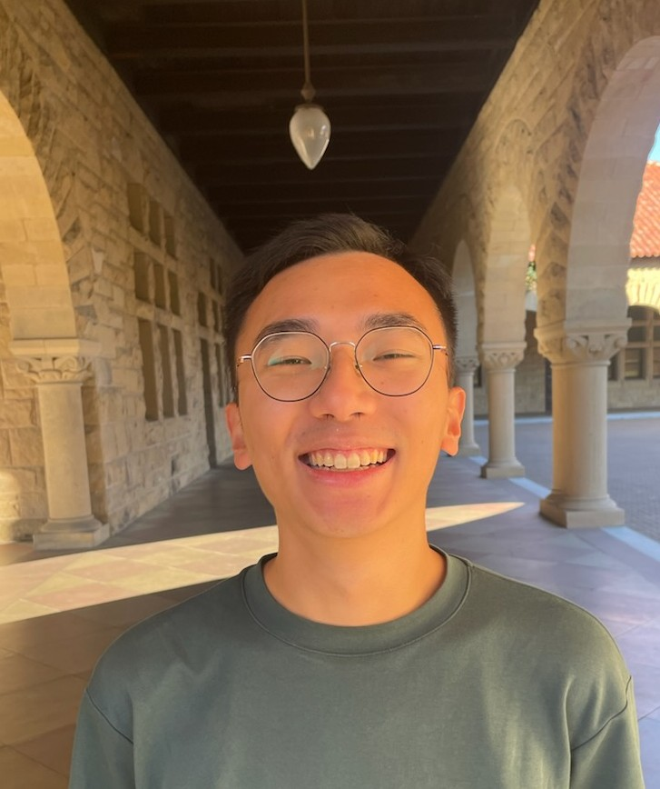
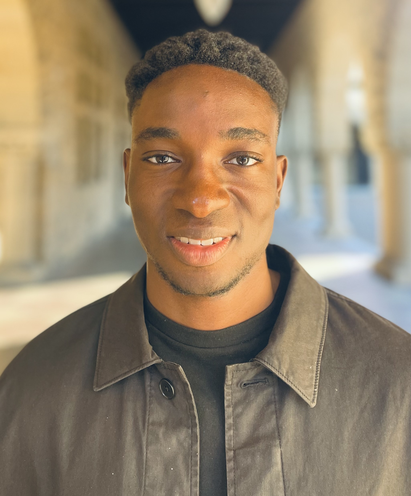

# Research Summary
Stanford accelerate group works on creating high performance and energy-efficient architectures and design methodology for domain-specific hardware accelerators in existing and emerging technologies.

# People
<table style="width:100%">
  <tbody>
    <tr>
      <td style="width:18%"></td>
      <td>
        <b>Priyanka Raina</b>  
        <b>Email:</b> praina AT stanford DOT edu 
        <b>Contact:</b> Allen Building - Room 114 
        <b>About:</b> Priyanka Raina is an Associate Professor of Electrical Engineering at Stanford University. She received her BTech in Electrical Engineering from IIT Delhi in 2011 and her SM and PhD in Electrical Engineering and Computer Science from MIT in 2013 and 2018. Priyanka’s research is on creating high-performance and energy-efficient architectures for domain-specific hardware accelerators in existing and emerging technologies and agile hardware-software co-design. Her research has won best paper awards at VLSI, ESSCIRC and MICRO conferences and in the JSSC journal. Priyanka teaches several VLSI design classes at Stanford. She has also won the Sloan Research Fellowship, NSF CAREER Award, DARPA Young Faculty Award, Intel Rising Star Faculty Award, Hellman Faculty Scholar Award and is a Terman Faculty Fellow. </td>
    </tr>
  </tbody>
</table>

## PhD Students
<table style="width:100%">
  <tbody>
    <tr>
      <td style="width:18%"></td>
      <td>
        <b>Jeffrey Yu</b>  
        <b>Email:</b> jeffreyy AT stanford DOT edu 
        <b>About:</b> Jeffrey is an EE Ph.D. student at Stanford University supervised by Prof. Priyanka Raina. He received his B.S. degree in Computer Engineering from UC San Diego in 2021. 
        <b>Research:</b> His research focuses on edge device training, efficient ML algorithms, and deep neural network quantization. In particular, he is working on low-precision multi-modal AI and building an hardware accelerator for mix-reality workloads. 
      </td>
    </tr>
    <tr>
      <td style="width:18%"></td>
      <td>
        <b>Yuchen Mei</b>  
        <b>Email:</b> yuchenm AT stanford DOT edu, <a href="https://www.linkedin.com/in/yuchenmei/">Webpage</a> 
        <b>About:</b> Yuchen Mei is an EE Ph.D. student at Stanford University supervised by Prof. Priyanka Raina. He received his B.S. degree in Electronic Information Science and Technology from Nanjing University (China) in 2021 and M.S. in Electrical Engineering from Stanford University in 2023. 
        <b>Research:</b> His research interests lie in reconfigurable dataflow architectures and systems for programmable, energy-efficient AI inference at the edge. Before joining Stanford, he worked on 3D-CNN optimization and hardware security.
      </td>
    </tr>
    <tr>
      <td style="width:18%"></td>
      <td>
        <b>Bo-Wun Chen</b>  
        <b>Email:</b> bwcheng AT stanford DOT edu, <a href="https://linkedin.com/in/bo-wun-cheng/">Webpage</a> 
        <b>About:</b> Bo-Wun Cheng is an EE Ph.D. student at Stanford University supervised by Prof. Priyanka Raina. He received his B.S. and M.S. degrees in Computer Science from National Tsing Hua University (Taiwan) in 2021 and 2023, respectively. 
        <b>Research:</b> His current research interest resides in designing and architecting efficient hardware accelerators. Before joining Stanford, his research spans the fields of Graphics Processing Unit memory architecture design and computer vision.
      </td>
    </tr>
    <tr>
      <td style="width:18%"></td>
      <td>
        <b>Michael Oduoza</b>  
        <b>Email:</b> mcoduoza AT stanford DOT edu, <a href="https://linkedin.com/in/michael-oduoza/">Webpage</a> 
        <b>About:</b> Michael Oduoza is an EE Ph.D. student at Stanford University supervised by Prof. Priyanka Raina. He received his B.S. and M.S. degrees in Electrical Engineering from Stanford in 2021 and 2022 respectively.   
        <b>Research:</b> His research focuses on hardware/software co-design to create energy-efficient computing systems. He is broadly interested in designing new computer architectures for emerging machine learning applications. His pre-Ph.D. research spanned a range of topics, from semiconductor devices to circuits to systems.  
      </td>
    </tr>
    <tr>
      <td style="width:18%"></td>
      <td>
        <b>Xinyuan Allen Pan</b> 
        <b>About:</b> Xinyuan Allen Pan is a Ph.D. student in Electrical Engineering at Stanford University, advised by Prof. Priyanka Raina. He received his M.Eng. in Electrical Engineering and Computer Sciences from the University of California, Berkeley, in 2023, and his B.S. in Electrical Engineering from The University of Texas at Austin in 2019. He previously worked as an ASIC engineer at Cisco Systems. 
        <b>Research:</b> His research interests lie in hardware architectures and compiler techniques for programmable, portable, and efficient AI accelerator systems.
      </td>
    </tr>
    <tr>
      <td style="width:18%"></td>
      <td>
        <b>Zhouhua Xie</b> 
        <b>About:</b> Zhouhua Xie received the B.S. degree in electrical engineering from Stanford University, Stanford, CA, USA, in 2025, where he is currently pursuing the Ph.D. degree in electrical engineering under the supervision of Prof. Priyanka Raina. 
      </td>
    </tr>
    <tr>
      <td style="width:18%"></td>
      <td>
        <b>Sai Gautham Ravipati</b> 
        <b>About:</b> Sai Gautham Ravipati received the M.S. degree from Stanford University, Stanford, CA, USA, in 2025, and the B.Tech. degree in electrical engineering from IIT Madras, Chennai, India, in 2023. He is currently pursuing the Ph.D. degree in electrical engineering with Stanford University. 
        <b>Research:</b> His research interests include programming systems, domain-specific compilers, and hardware-software co-design.
      </td>
    </tr>
  </tbody>
</table>    

<!--
## Masters Students
<table style="width:100%">
  <tbody>
  </tbody>
</table>
-->

## Administrator
<table style="width:100%">
  <tbody>
    <tr>
      <td style="width:18%"></td>
      <td>
        <b>Julie Kline</b>  
        <b>Email:</b> klinej AT stanford DOT edu 
        <b>Contact:</b> Packard Building - Room 359 
        <b>About:</b> Julie Kline is a Faculty Administrator at Stanford, and she supports several Electrical Engineering professors and their research teams. She holds a master’s degree in English from San Jose State University, and prior to her work at Stanford, she spent several years teaching academic writing and rhetoric at De Anza College in Cupertino. Julie is an active member at Coastal Repertory Theatre in Half Moon Bay, where in addition to acting, directing, and producing, she serves on several committees and the Board of Directors. </td>
    </tr>
  </tbody>
</table>
