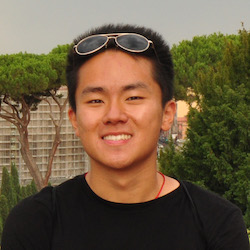
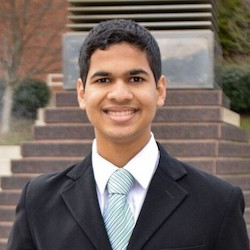
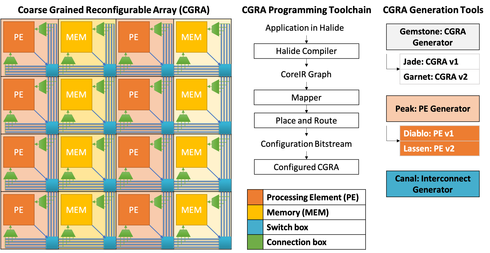

Group photo from March 1, 2019. From left to right: Kartik Prabhu, Fei Huang, Akash Levy, Priyanka Raina, Haitong Li and Weier Wan.
# Research Summary

Stanford accelerate group works in three areas:
1. High performance and energy-efficient digital hardware accelerators for applications such as computational imaging, vision and machine learning. 
2. Accelerator architectures that leverage the unique physical characteristics of emerging non-volatile memory technologies. 
3. Agile hardware design to improving design productivity. We are creating generators and architectures for reconfigurable accelerators and their compiler toolchains.

# People
## Faculty

### Priyanka Raina 

| Email          | praina AT stanford DOT edu |
|:---------------|:------------------|
| Contact        | Allen Building - Room 114, (617) 899-3791 |
| About          | Priyanka Raina is an Assistant Professor in Electrical Engineering at Stanford University. Previously, she was a Visiting Research Scientist in the Architecture Research Group at NVIDIA Corporation. She received her Ph.D. degree in 2018 and S.M. degree in 2013 in EECS from MIT and her B.Tech. degree in EE from IIT Delhi in 2011. |
| Teaching       | Priyanka teaches [EE271: Introduction to VLSI Systems](http://web.stanford.edu/class/ee271/) in the Fall and EE272: Design Projects in VLSI Systems in the Winter. |

## Administrator

### Julie Kline

| Email        | klinej AT stanford DOT edu |
|:-------------|:------------------|
| Contact      | Packard Building - Room 359, (650) 723-4539 |

## Students
### PhD Students

### Haitong Li

| Email        | haitongl AT stanford DOT edu |
|:-------------|:----------------------|
| Webpage      | <https://www.linkedin.com/in/haitongli/> |
| About        | Haitong Li is an EE Ph.D. candidate at Stanford University, supervised by Prof. H.-S. Philip Wong and co-advised by Prof. Priyanka Raina. Previously, he was a Research Intern in the Device, Circuit and System (DCS) Group at Arm. He received M.S. in Electrical Engineering from Stanford University in 2017, and B.S. in Microelectronics from Peking University, China, in 2015. He is a recipient of 2016 IEEE EDS Masters Student Fellowship. |
| Research     | My research is focused on in-memory computing enabled by emerging non-volatile memory technologies. The application space ranges from deep learning inference (DAC'19) to hyper-dimensional computing (IEDM'16, ISSCC'18) for cognitive applications, while leveraging the unique physical characteristics of emerging devices (e.g., stochasticity, 3D vertical connectivity). I also collaborate closely with Prof. Subhasish Mitra (Stanford) and Prof. Jan Rabaey (UC Berkeley). For more details, please refer to this [Google Scholar profile](https://scholar.google.com/citations?user=0zX2pcwAAAAJ&hl=en). |

### Weier Wan

| Email        | weierwan AT stanford DOT edu |
|:-------------|:----------------------|
| Webpage      | <https://www.linkedin.com/in/weier-wan/> |
| About        | Weier Wan is an EE Ph.D. candidate at Stanford University, supervised by Prof. H.-S. Philip Wong and co-advised by Prof. Priyanka Raina. Previously, he was a Research Intern at Google X. He received M.S. in Electrical Engineering from Stanford University in 2017, and B.S. in Electrical Enginnering and Computer Science and B.A. in Physics from UC Berkeley, in 2015. |
| Research     | My research focuses on using resistive memory (RRAM) based analog in-memory computing to enable energy and area-efficient machine learning. Recently I designed and taped-out (and currently testing) a fully-integrated mixed-signal chip with RRAM synapses monolithically integrated with CMOS neurons. The chip implements inference and training for Restricted Boltzmann Machine, a type of probablistic graphical model, as well as inference for MLPs and RNNs. The project is a collaborative effort with Prof. Gert Cauwenberghs (UCSD) and Prof. Huaqiang Wu (Tsinghua University). I also studied novel techniques for quantizing deep neural networks (<https://github.com/google-research/google-research/tree/master/cnn_quantization>) |

### PhD Rotation Students

### Akash Levy 

| Email        | akashl AT stanford DOT edu |
|:-------------|:----------------------|
| Webpage      | <https://www.linkedin.com/in/akashlevy/> |
| About        | Akash Levy is an EE Ph.D. student at Stanford University, supervised by Prof. Priyanka Raina. Previously, he was a Research Intern at Amazon Lab126 and Amazon Web Services. He received a B.S.E. degree in Electrical Engineering from Princeton University in 2018, with certificates in Applications of Computing and Engineering Physics. He is a recipient of the 2018 NSF Graduate Research Fellowship.|
| Research     | My current research is focused on improving the efficiency of reconfigurable logic devices (such as FPGAs and CGRAs) through the use of 3D integration with emerging nanotechnologies. In particular, I am developing a hybrid design that makes use of both resistive random access memory (RRAM) and nanoelectromechanical (NEM) relays to implement reconfigurable switching in the back-end-of-line for reduced reconfigurability overhead. My ultimate goal is to enable reconfigurable logic devices to become more competitive with ASICs in terms of power, area, and performance. My pre-PhD research involved a broad range of subjects, ranging from physics to computer security. For more details, please refer to my [Academia.edu portfolio](https://stanford.academia.edu/AkashLevy) and my [Google Scholar profile](https://scholar.google.com/citations?user=A0Auh6EAAAAJ&hl=en). |

### Fei Huang

| Email        | feihuang AT stanford DOT edu |
|:-------------|:-----------------------------|
| Webpage      | <https://www.linkedin.com/in/fei-huang-72177797/> |
| About        | Fei Huang is an EE Ph.D. student at Stanford University, supervised by Prof. Priyanka Raina. He received M.S. and B.S. degree in Electrical Materials & Devices from University of Electronic Science and Technology of China in 2018 and 2015 respectively. |
| Research     | My current research is focused on reducing the latency and energy in telecommunication systems through the use of hardware accelerators. In particular, I am focusing on the resource allocation problem and MIMO decoding problem in 5G wireless systems. |

### Masters Students

### Kartik Prabhu

| Email         | kprabhu7 AT stanford DOT edu |
|:--------------|:-----------------------------|
| Webpage       | <https://linkedin.com/in/kprabhu7/> |
| About         | Kartik Prabhu is an EE M.S. student at Stanford University. Previously, he was a software engineering intern at Cisco. He received a B.S. degree in Computer Engineering from Georgia Institute of Technology in 2018. |
| Research      | My current research involves creating generators for DNN accelerators. The generator is written using high-level synthesis (HLS) to enable for the creation of a DNN accelerator given a set of parameters, and can generate many of the architectures that have been proposed. |

# Research
## Current Projects

### Agile Hardware (AHA)
**People: Faculty - Priyanka Raina, Mark Horowitz, Pat Hanrahan, Clark Barrett, Kayvon Fatahalian, and many students advised by these faculty**

The goals of the agile hardware project are
1. To create a programmable platform (a coarse grained reconfigurable array or CGRA and its programming toolchain) tuned to running specific applications (such as neural networks and image processing pipelines) efficiently. 
2. To use and develop agile techniques in the design of platform itself. 

More information about the project can be found on the [project webpage](https://aha.stanford.edu). All the hardware designed in the project and its programming toolchain are open-source and can be found on the project [github](https://github.com/StanfordAHA). There are multiple faculty and students working on different parts of the project; described below are the parts that Priyanka is actively involved in:

#### 1. Gemstone - CGRA Generator and Garnet - The second generation CGRA
**Gemstone** is a CGRA generation infrastructure that comprises
* Library of reusable CGRA components written in [Magma](https://github.com/phanrahan/magma) such as PE core, Memory core and Interconnect. These components will be eventually generated using their own DSLs (such as peak below), and gemstone will contain all of the glue that is needed to put these components together to create a CGRA.
* Methods that enable you to write passes on the RTL - 
    * Passes can transform RTL to make it amenable to other portions of the design flow.
    * Passes can generate collateral for other portions of the design flow (like physical design, verification).

**Garnet** is our second generation CGRA. Compared to Jade, the first generation CGRA, garnet has several new features:
* A new PE, Lassen, that supports BFloat and transcendental operations.
* A global buffer that can be configured as a double buffer to support neural networks efficiently. 
* Support for fast reconfiguration.
* Configurable power domains for saving power by turning off unused portions of the CGRA.
**Code:** [Garnet](https://github.com/StanfordAHA/garnet)

#### 2. Peak - PE Generation DSL and Lassen - PE for Garnet CGRA 
**Peak** is a domain specific language (DSL) embedded in python that we have designed to specify the processing element (PE) of our CGRA. The goal is to have the PE specification be the single source of truth, and have peak automatically generate RTL, testbench, mapper and documentation for the PE from it. **Code:** [Peak](https://github.com/phanrahan/peak)

**Lassen** is our second generation PE. Compared to the first generation PE, Diablo, Lassen has several new features including support for BFloat add and multiply, and instructions that allow multiple PE and MEM tiles to be grouped to support transcendental functions such as div, log, e^x, sin and pow. **Code:** [Lassen](https://github.com/StanfordAHA/whitney)

#### 3. SoC 
In addition to the new CGRA, our next chip will have the first version of our SoC with a control processor and a flexible interconnect. We are invesitigating both ARM and RISC-V based designs.

* * *

### In-Memory Compute Architecture for One-Shot Learning Applications

**People: Haitong Li, Philip Wong, Priyanka Raina**

Machine and deep learning workloads have been moving from cloud to edge, due to the real-time requirement, bandwidth challenges, and privacy concerns. Today's edge computing solutions are mainly providing inference capabilities. Yet, more complicated and realistic scnearios require 'learning' capabilities to meet the fast-changing environments at the user ends. Towards the goal of delivering such machine inteligence at edge, we plan to explore the opportunies of one-shot and few-shot learning, which essentially represent an online learning scenario with rapid acquisition of few unseen examples. 

State-of-the-art memory-augmented neural networks combine the best characteristics of parametric models (e.g., CNN/LSTM) and non-parametric models (e.g., nearest neighbors). The idea is that features extracted by front-end NNs can be stored in an associative memory, inspired by human's working memory, where similarity measurement is key to enable rapid recall & reasoning for one/few-shot learning. 

With the increasing complexity in feature space from multi-media data, hardware acceleration opportunities arise for efficient implementations of associative memories. Our approach is to explore in-memory computing architectures enabled by emerging non-volatile memory (NVM) technologies (e.g., resistive RAM). The unique capability is doing in-situ distance comparison in a non-volatile fashion. At architecture level, we're exploring the design spaces of the front-end feature extrator and the associative memories with realistic NVM characteristics, aimed at providing energy efficiency benefits for large-scale datasets. 

* * *

### Hybrid RRAM/NEMS-Based 3D Interconnect Design for Programmable Logic Devices

**People: Akash Levy, Priyanka Raina**

Field-programmable gate arrays (FPGAs) are programmable logic devices (PLDs) that enable rapid prototyping of digital circuits and provide an alternative to the expensive application-specific integrated circuit (ASIC) design process today. However, when compared with ASICs performing the same function, SRAM-based FPGAs typically have 10-40 times lower logic density, 3-4 times higher delay, and 5-12 times higher dynamic power dissipation. This is because reconfigurable components incur large overhead---instead of being packed tightly, configurable logic blocks (CLBs) in FPGAs are laid out relatively far apart to make space for routing components, resulting in greater interconnect delay, power dissipation, and chip area. The disparity in the performance of FPGAs and ASICs provides motivation to find ways to reduce reconfigurability overhead, so that ultimately PLDs can become competitive with ASICs at manufacturing scale. Possible solutions lie with PLD designs that trade off fine-grained CLBs with more specialized blocks e.g. coarse-grained reconfigurable arrays (CGRAs), or with emerging nanotechnologies that enable novel design strategies in the space of reconfigurable semiconductor devices (to be discussed later).

Another topic of interest in semiconductor design today is "normally off, instantly on" device operation, which is critical for devices with weak, unreliable, or intermittent power sources. Energy-harvesting devices, wearables, and low-power nodes in the Internet of Things (IoT) will need to be able to operate in this mode to prevent unnecessary power dissipation between periods of action. Today, FPGAs need to load their configuration from off-chip memory into SRAM on startup. This has motivated the development of integrated non-volatile memory (NVM) that can replace (or work well in conjunction with) on-chip SRAMs to enable intermittent computing.

In this project, we propose the use of two emerging nanotechnologies in PLD design for bridging the gap between PLDs and ASICs: resistive random access memory (RRAM) and nanoelectromechanical (NEM) relays. We describe a hybrid RRAM-NEM-based design for implementing PLDs with both "normally off, instantly on" device operation and low-overhead reconfigurable routing components. We exploit the properties of RRAM and NEM relays in a synergistic fashion to develop a novel NV-SRAM-based router that has all of its read circuitry implemented in back-end-of-line (BEOL), with RRAM cells directly controlling gate voltage of hysteretic NEM relays that behave as routers. We compare the design of a CGRA developed using the techniques described here versus designs that use (1) NEM relays only, (2) RRAM only, and (3) standard CMOS technologies (baseline).

* * *

### Emerging Non Volatile Memory - Centric Accelerator for Deep Neural Network Inference and Training in 5G Applications

**People: Fei Huang, John Cioffi, Priyanka Raina**

* * *

### NVM-Based Neural Network Accelerators

**People: Fei Huang, Daniel Bankman, Robert M. Radway, Jonas Messner, Kartik Prabhu, Binh Q. Le, Priyanka Raina, Subhasish Mitra, Boris Murmann**

* * *

### RBM In-Memory Accelerator

**People: Weier Wan**

The project aims at realizing a fully integrated neuromorphic hardware with RRAM crossbar synapses array monolithically integrated with 130nm CMOS circuits to perform on-chip RBM inference and training. The entire chip consists of in total 48 cores, 3 million RRAM synapses and 12 thousand neurons. The architecture design aims at achieving maximum configurability and testability in an area-efficient and routable fashion. The goal is made possible by the neuron-synapse interconnect topology design. In contrast to previous neuromorphic hardware, where neurons are usually located at the side of synaptic array, in our design neurons and synapses are co-located in a distributed fashion, which is more similar to biological neural systems. Within one neural-synaptic core that consists of 256 neurons and 65K RRAM synapses, each neuron is connected with 1 row and 1 column of the synaptic crossbar and uses the same wire for receiving and firing spikes. The connection can be selectively turned on or off during different operations. Such topology not only allows the neuronal spikes to be sent in both crossbar row-to-column and column-to-row directions, which enables back-and-forth Gibbs sampling during the contrastive divergence training of RBM, but also enables recurrent connections. The combination of different operating modes enable a variety of models besides RBM, such as Multi-Layer Perceptron (MLP) and Recurrent Neural Network (RNN). Due to the close integration and excellent connectivity between neurons and synapse and the efficient analog computation of RRAM synapses, simulation shows that the design is able to achieve <1pJ per synaptic event energy efficiency. The chip is currently under testing.

* * *

### HLS-Based Framework for Generating Deep Neural Network Accelerators

**People: Kartik Prabhu, Xuan Yang, Mark Horowitz, Priyanka Raina**

Deep neural networks require custom accelerators in order to run with high performance and energy efficiency. Several DNN  accelerators that have been proposed have very similar properties, with some form of a systolic array and a hierarchy of on-chip buffers. However, designing accelerators from scratch is very expensive in terms of time and resources. To get around  this, we have created a generator framework using high-level synthesis that can create DNN accelerator designs with different parameters. In addition to this, we have a tool that performs design space exploration and finds the optimal set of parameters such as array and memory sizes in terms of energy and performance. The tool also finds the best scheduling (loop tiling and ordering) of any neural network layer on the accelerator. In other words, the system doesn't just generate the accelerator hardware, but also the compiler for it. We are using this system as a class project in EE272, our chip design bootcamp class.

#### Code
* [Github repository for accelerator generator](https://github.com/priyanka-raina/dnn-accelerator)
* [Github repository for compiler](https://github.com/xuanyoya/CNN-blocking/tree/dev)

* * * 

## Upcoming Projects

### Optimizing Computer Vision Performance with Energy-Efficient Deep ISPs
**People: Gordon Wetzstein, Priyanka Raina**

**We are looking for graduate students to work on this project! Please email Priyanka if you are interested.**

The capacity of imaging systems must continue to expand in order to keep pace with rapidly increasing, application-specific demands in robotic and machine vision, consumer photography, autonomous driving, surveillance and machine learning. State-of-the-art imaging systems optimize the image processing pipeline (ISP) for image quality as perceived by a human observer and they treat different stages of the ISP as separate blocks, which leads to sub-optimal performance. In particular, sensor noise, defocus and motion blur, as well as other imperfections in the image formation, especially in low-light environments, are fundamental challenges for achieving state of the art performance of computer vision algorithms, such as image classification and object detection with current ISPs. 

Stanford Computational Imaging Lab has proposed an optimization-based ISP approach that outperforms commercial implementations of Google Nexus phones significantly. They have recently explored novel end-to-end differentiable architecture for joint denoising, deblurring, and image classification that makes classification robust to realistic noise and blur. This architecture dramatically improves the accuracy of a classification network in low light and other challenging conditions, outperforming alternative approaches such as retraining the network on noisy and blurry images and preprocessing raw sensor inputs with conventional denoising and deblurring algorithms. The architecture learns denoising and deblurring pipelines optimized for classification whose outputs differ markedly from those of state-of-the-art denoising and deblurring methods, preserving fine detail at the cost of more noise and artifacts. These results suggest that the best low-level image processing for computer vision is different from existing algorithms designed to produce visually pleasing images.

At the same time, we recognize that the algorithms for computational imaging and vision are rapidly evolving, and hardware must follow suit: the next generation of hardware ISPs must be "programmable" to support new algorithms created with high-level frameworks. Our results for the AHA project suggest that the best programmable ISPs would be heterogeneous CGRAs with a multitude of small ASIC-style compute units. 

In this project, we will design an end-to-end ISP pipeline for computer vision tasks, primarily focusing on the application of object detection. Moreover, we will explore deep neural network architectures that generalize across other applications, including segmentation, tracking, face detection, and more. A dedicated neural network will be trained for all of these applications separately, but the larger goal of this project is to develop a unifying network architecture that represents the state-of-the-art computer vision pipeline (optimizing high-level vision tasks). We will also create a CGRA hardware architecture (and its programming toolchain) with compute units optimized for running this unifying network at high performance and energy-efficiency. We expect the outcome of this project to lay the foundations of future energy-efficient and programmable mobile image processors.

* * *

### Objective Body Surface Area Determination for the Investigation of Vitiligo Clinical Outcomes
**People: Dr. Victor Huang (UC Davis), Priyanka Raina**

**We are looking for students to work on this project! Please email Priyanka if you are interested.**

Vitiligo is an autoimmune condition that targets melanocytes, the pigment producing cells of the skin, and results in large patches of skin losing their color. It affects approximately 1% of the population and has significant negative effects on the quality of life of patients. Vitiligo progresses over the course of months to years and response to treatment may, similarly, require months to years to become apparent. This is a significant hurdle as selecting an optimal treatment strategy such as immune suppression versus surgical approaches hinges on being able to accurately assess residual disease activity. However, there is no sensitive and objective outcome measure to characterize the spread of the disease, and this has been a major hurdle for optimizing clinical care as well as for development of clinical trials for vitiligo.

To assess the spread of vitiligo, a clinician commonly performs a visual examination of the patient and assigns a VASI (Vitiligo Area Scoring Index), or a VETF (Vitiligo European Task Force) score that corresponds to the depigmented body surface area (BSA) or ‘lesion(s)’. However, this method has low accuracy, high variability, and is insensitive to small changes. The gold standard of lesion area assessment involves planimetry, where a lesion is manually traced onto a transparent grid sheet from which area is calculated. This approach is time intensive, however, and limited to individual lesions and not suited to evaluating involvement across an entire body or region. There have been attempts at measuring relative change in lesion area using image analysis based on 2D color images which do not require manual lesion segmentation but they still introduce a 20-40% error in area calculated depending on the angle of image acquisition since the lesions are on curved body surfaces. Additionally, they only measure relative area change between two images taken at different times, and not absolute surface area.

We propose the development and clinical evaluation of a fully-automated computer-assisted system that quantitatively and accurately assesses 3D BSA using depth and color imaging and machine learning based vision algorithms. The greater sensitivity of this method will detect currently sub- clinical changes, which can be clinically significant in defining disease activity and predicting both initial response and durability of response to treatment. In addition, this technology can be later adapted for analysis of any skin condition for which BSA is an outcome measure of interest, such as psoriasis, melanoma, dermatological reactions to drugs and wounds.

* * * 

## Previous Projects
### Tensorloop: A Systematic Approach to DNN Accelerator Evaluation (Nvidia)

**People: Angshuman Parashar, Priyanka Raina, Sophia Shao, Rangharajan Venkatesan, Yu-Hsin Chen, Brucek Khailany, Stephen W. Keckler, Joel Emer**

Tensorloop is an infrastructure for evaluating and exploring the architecture design space of deep neural network (DNN) accelerators. Timeloop uses a concise and unified representation of the key architecture and implementation attributes of  DNN accelerators to describe a broad space of hardware topologies. It can then emulate those topologies to generate an   accurate projection of performance and energy efficiency for a DNN workload through a mapper that finds the best way to  schedule operations and stage data on the specified architecture. This enables fair comparisons across different architectures and makes DNN accelerator design more systematic. 

#### Publications
* A. Parashar, P. Raina, S. Shao, A. Mukkara, V. A. Ying, R. Venkatesan, Y. H. Chen, B. Khailany, S. Keckler, J. Emer, "Tensorloop: A Systematic Approach to DNN Accelerator Evaluation", to be presented at ISPASS 2019.

* * * 

### Motion Magnification Accelerator (MIT)

**People: Priyanka Raina, Bill Freeman, Fredo Durand, Anantha Chandrakasan**

* * * 

### An Energy-Scalable Accelerator for Blind Image Deblurring (MIT)

**People: Priyanka Raina, Mehul Tikekar, Bill Freeman, Fredo Durand, Anantha Chandrakasan**

Camera shake is the leading cause of blur in cell-phone camera images. Removing blur requires deconvolving the blurred image with a kernel which is typically unknown and needs to be estimated from the blurred image. This kernel estimation is computationally intensive and takes several minutes on a CPU which makes it unsuitable for mobile devices.

This work presents the first hardware accelerator for kernel estimation for image deblurring applications. Our approach, using a multi-resolution IRLS deconvolution engine with DFT-based matrix multiplication, a high-throughput image correlator and a high-speed selective update based gradient projection solver, achieves a 78x reduction in kernel estimation runtime, and a 56x reduction in total deblurring time for a 1920 x 1080 image enabling quick feedback to the user. Configurability in kernel size and number of iterations gives up to 10x energy scalability, allowing the system to trade-off runtime with image quality. The test chip, fabricated in 40nm CMOS, consumes 105mJ for kernel estimation running at 83MHz and 0.9V, making it suitable for integration into mobile devices.

#### Publications and Talks
* P. Raina, M. Tikekar, and A. P. Chandrakasan, "An energy-scalable accelerator for blind image deblurring," in IEEE Journal of Solid-State Circuits (JSSC) - ESSCIRC Special Issue, July 2017. (Invited) [Paper](https://ieeexplore.ieee.org/document/7891902)
* P. Raina, M. Tikekar, and A. P. Chandrakasan, "An energy-scalable accelerator for blind image deblurring," in IEEE European Solid-State Circuits Conference (ESSCIRC), Sep 2016, pp. 113-116. [Paper](https://ieeexplore.ieee.org/document/7598255)
* P. Raina, M. Tikekar, A. P. Chandrakasan, "An Energy-Scalable Co-processor for Blind Image Deblurring," presented at IEEE International Solid-State Circuits Conference (ISSCC) Student Research Preview (SRP) Poster Session, Feb. 2016. Received the 2016 ISSCC Student Research Preview Award.

* * *

### Reconfigurable Processor for Computational Photography (MIT)

**People: Rahul Rithe, Priyanka Raina, Nathan Ickes, S. V. Tenneti, Fredo Durand, Anantha Chandrakasan** 

Computational photography refers to a wide range of image capture and processing techniques that extend the capabilities of digital photography and allow users to take photographs that could not have been taken by a traditional camera. Since its inception less than a decade ago, the field today encompasses a wide range of techniques including high dynamic range (HDR) imaging, low light enhancement, panorama stitching, image deblurring and light field photography. These techniques have so far been software based, which leads to high energy consumption and typically no support for real-time processing.

This work focuses on a hardware accelerator for bilateral filtering which is commonly used in computational photography applications. Specifically, the 40 nm CMOS test chip performs HDR imaging, low light enhancement and glare reduction while operating from 98 MHz at 0.9 V to 25 MHz at 0.9 V. It processes 13 megapixels/s while consuming 17.8 mW at 98 MHz and 0.9 V, achieving significant energy reduction compared to previous CPU/GPU implementations, enabling real-time computational photography applications on mobile devices. Live demonstration at the ISSCC Demo Session. [Video](http://player.vimeo.com/video/70417371)

#### Publications and Talks
* R. Rithe, P. Raina, N. Ickes, S. V. Tenneti, A. P. Chandrakasan, "Reconfigurable Processor for Energy-Efficient Computational Photography," IEEE Journal of Solid-State Circuits (JSSC), vol. 48, no. 11, pp. 2908-2919, Nov. 2013. [Paper](http://ieeexplore.ieee.org/xpls/abs_all.jsp?arnumber=6623206)
* R. Rithe, P. Raina, N. Ickes, S. V. Tenneti, A. P. Chandrakasan, "Reconfigurable Processor for Energy-Scalable Computational Photography," IEEE International Solid-State Circuits Conference (ISSCC), 164-165, February 2013. [Paper](http://ieeexplore.ieee.org/xpls/abs_all.jsp?arnumber=6487683)

#### In the News
* Picture Perfect: Quick, efficient chip cleans up common flaws in amateur photographs. ([MIT News](http://web.mit.edu/newsoffice/2013/computational-photography-chip-0219.html))
* Image Processor Makes for Better Photos and Performance ([IEEE The Institute](http://theinstitute.ieee.org/technology-focus/technology-topic/image-processor-makes-for-better-photos-and-performance))
* MIT imaging chip creates natural-looking flash photos. ([Engadget](http://www.engadget.com/2013/02/21/mit-imaging-chip-blends-shots-with-and-without-flash/))
* MIT's new chip promises 'professional-looking' photos on your smartphone. ([DPReview](http://connect.dpreview.com/post/2110851336/mit-photo-chip-smartphone-photos))
* Improve your smartphone's photo quality with this chip. ([Mashable](http://mashable.com/2013/02/21/photo-chip/))

* * * 

### A 3D Vision Processor for a Navigation Device for the Visually Challenged (MIT)

**People: Dongsuk Jeon, Nathan Ickes, Priyanka Raina, H. C. Wang, Anantha Chandrakasan**

3D imaging devices, such as stereo and time-of-flight (ToF) cameras, measure distances to the observed points and generate a depth image where each pixel represents a distance to the corresponding location. The depth image can be converted into a 3D point cloud using simple linear operations. This spatial information provides detailed understanding of the environment and is currently employed in a wide range of applications such as human motion capture. However, its distinct characteristics from conventional color images necessitate different approaches to efficiently extract useful information.

This chip is a low-power vision processor for processing such 3D image data. The processor achieves high energy-efficiency through a parallelized reconfigurable architecture and hardware-oriented algorithmic optimizations. The processor will be used as a part of a navigation device for the visually impaired. This handheld or body-worn device is designed to detect safe areas and obstacles and provide feedback to a user. We employ a ToF camera as the main sensor in this system since it has a small form factor and requires relatively low computational complexity.

#### Publications and Talks
* D. Jeon, N. Ickes, P. Raina, H. C. Wang, A. P. Chandrakasan, "24.1 A 0.6V 8mW 3D vision processor for a navigation device for the visually impaired," IEEE International Solid-State Circuits Conference (ISSCC), Feb. 2016. [Paper](http://ieeexplore.ieee.org/xpls/abs_all.jsp?arnumber=7418084)

#### In the News

* A virtual “guide dog” for navigation. ([MIT News](http://news.mit.edu/2016/virtual-guide-dog-wearable-device-0202#.VrHZj9k0f5g))
* MIT researchers have developed a ‘virtual guide dog’. ([boston.com](https://www.boston.com/news/local-news/2016/02/03/mit-researchers-have-developed-a-virtual-guide-dog))
* Wearable with 3D camera to guide visually impaired. ([Pune Mirror](http://www.punemirror.in/others/scitech/Wearable-with-3D-camera-to-guide-visually-impaired/articleshow/50855649.cms))

More details about Priyanka's PhD work are on [Priyanka's MIT webpage](http://web.mit.edu/~praina/www/index.html).

* * *

## Previous Students
### PhD Rotation Students
* Raman Vilkhu (vilkhu AT stanford DOT edu), Autumn 2018
